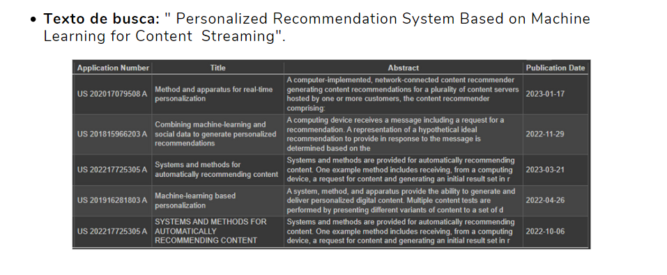
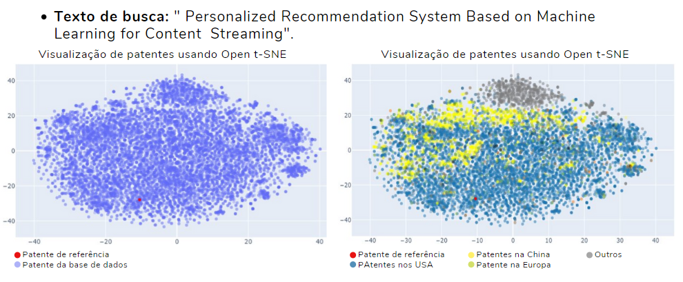
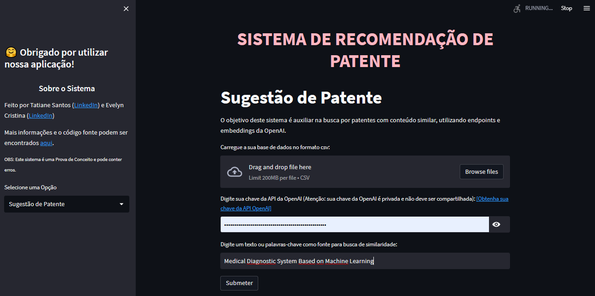

# Sistema de Recomendação de Patentes 💡🔍

AUTORES: 
* TATIANE SANTOS
* EVELYN LIMA
         
Este projeto implementa um Sistema de Recomendação de Patentes personalizado que utiliza o modelo de linguagem Ada-002 da OpenAI. Analisa dados de texto fornecidos pelo usuário e gera sugestões relevantes com base em conjuntos de palavras.

## Funcionalidades 🚀

O projeto consiste em duas partes:

### Parte 1: Embeddings_Patente.ipynb

O notebook `Embeddings_Patente.ipynb` realiza as seguintes etapas:

- Indicação de um conjunto de dados de publicações de patentes.
- Utilização do endpoint de embeddings do OpenAI para gerar representações vetoriais de alta qualidade para cada texto de patente. ✨
  * Essas embeddings são geradas a partir da união do Título e do Resumo de cada Patente.
  * Utilização do modelo de incorporação `text-embedding-ada-002` fornecido pelo OpenAI para gerar vetores de alta qualidade para cada texto de patente.
  * Aplicação da codificação `cl100k_base`, que é específica para o modelo de incorporação `text-embedding-ada-002`.
- Preparação dos dados para análise ou tarefas de aprendizado de máquina posteriores.

### Parte 2: Sugestion_Patente.ipynb

O notebook `Sugestion_Patente.ipynb` realiza as seguintes etapas:

- Carrega o arquivo CSV gerado no notebook da parte 1.
- Implementa um sistema de recomendação que retorna os 5 principais resultados de patentes semelhantes com base nos vetores de embeddings. 🎯
- Visualização das patentes utilizando a técnica T-SNE para redução de dimensionalidade, permitindo uma representação visual dos dados. 🌐

## Requisitos ✅

- Python 3.7 ou superior
- Bibliotecas Python necessárias: [lista de bibliotecas utilizadas]

## Como usar 📚

1. Execute o primeiro notebook (`Embeddings_Patente.ipynb`) para gerar os embeddings das patentes.

2. Em seguida, execute o segundo notebook (`Sugestion_Patente.ipynb`) para obter as recomendações de patentes semelhantes e visualizar os resultados.

## Exemplo de Resultado 📷




## Aplicação: Sistema de Recomendação de Patente



O sistema também inclui uma aplicação interativa desenvolvida com o Streamlit. A aplicação permite realizar consultas e receber recomendações de patentes semelhantes. Veja como usar:

1. Abra o terminal ou shell.

2. Crie um novo ambiente virtual usando o Conda com o seguinte comando:

```conda create --name nome_do_ambiente python=3.9```

3. Ative o ambiente virtual recém-criado com o seguinte comando:

```conda activate nome_do_ambiente```

4. Navegue até o diretório raiz do projeto:

```cd caminho/para/o/diretorio```

5. Instale as dependências do projeto:

```pip install -r requirements.txt```

6. Execute a aplicação com o seguinte comando:

`streamlit run Aplicacao.py`.

 -  Pode acessar também a aplicação no seu navegador no endereço `http://localhost:8501`.
 -  Na interface da aplicação, você pode inserir uma consulta de patente e receber recomendações de patentes semelhantes com base em um algoritmo de recomendação pré-treinado. 
        * Essa consulta deve ser feita com o arquivo .csv obtido no primeiro notebook (`Embeddings_Patente.ipynb`) e que já contempla as embeddings das patentes.
 -  Quando terminar de usar a aplicação, pressione Ctrl+C no terminal para encerrar a execução.

Quando terminar de usar a aplicação, pressione Ctrl+C no terminal para encerrar a execução.

## Contribuição 👥

Contribuições são bem-vindas! 🤝
